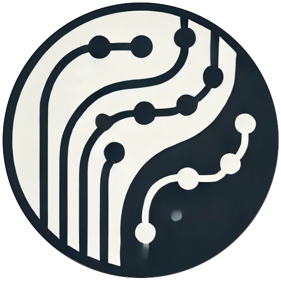

  

# ROSBAG GPT


## Goal

Use LLM to analyze and visualize sensor data in rosbag and generate reports.

## Features
- ros version: foxy, humble
- rosbag: ```mcap```, ```db3```
- ros topic type: [```sensor_msgs/Image```](http://docs.ros.org/en/melodic/api/sensor_msgs/html/msg/Image.html), [```sbg_driver/SbgGpsPos```](http://docs.ros.org/en/api/sbg_driver/html/msg/SbgGpsPos.html), [```sensor_msgs/PointCloud2```](http://docs.ros.org/en/melodic/api/sensor_msgs/html/msg/PointCloud2.html), [```sensor_msgs/LaserScan```](http://docs.ros.org/en/melodic/api/sensor_msgs/html/msg/LaserScan.html)
- gpt-4o


## Installation

Docker environment (recommended)
<details><summary> <b>Expand</b> </summary>

``` shell
# create the docker container
nvidia-docker run --name yolov7 -it -v your_coco_path/:/coco/ -v your_code_path/:/yolov7 --shm-size=64g nvcr.io/nvidia/pytorch:21.08-py3

# apt install required packages
apt update
apt install -y zip htop screen libgl1-mesa-glx

# pip install required packages
pip install seaborn thop

# go to code folder
cd /yolov7
```

</details>

## Example Snippets
- **Exrtact specific topic messages from ros2bag**

- **Extract all messages frame given a timestamp from ros2bag**

- **Draw path map from ros2bag / csv**

- **Use gpt-4o to analyse images and generate report**


## Unittest 
The unittest fixture files can be found at [xrkong/nuway_rosbag](https://huggingface.co/datasets/xrkong/nuway_rosbag).  
```bash
huggingface-cli download --repo-type dataset --local-dir ./unittest/fixture  xrkong/nuway_rosbag
```
Put the files under ```/unittest/fixture```

## Tutorial
```
python plot_ros2bag -h
```

# Roadmap

- [x] Deserialize from ros2 bag, (.db3 file)
- [x] Get data, like /lidar_safety/front_left/scan, /ins0/gps_pos, /ins0/orientation
- [x] Plot them
- [x] If there is a icon of the vechicle, add into a middile.
- [x] plot map

# Unit test 


