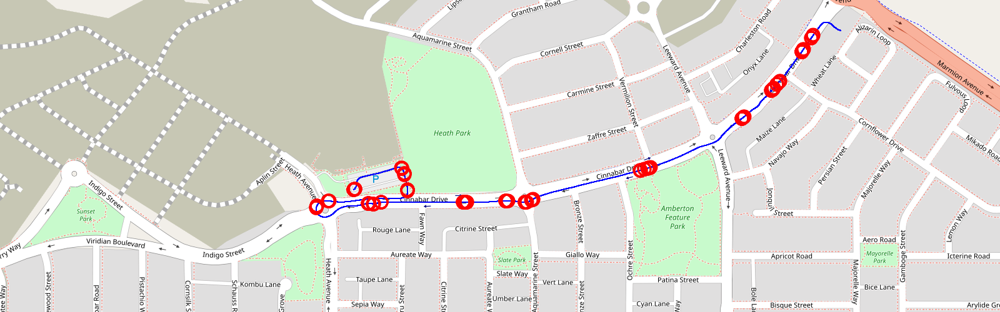

# 🗺️ Plot rosbag NOW!

A tool to visualise an autonomous vheicle data including path, lidar and camera from ros2bag files.

# Supported Versions
- ros version: foxy, humble
- rosbag: ```mcap```, ```db3```
- ros topic type: [```sensor_msgs/Image```](http://docs.ros.org/en/melodic/api/sensor_msgs/html/msg/Image.html), [```sbg_driver/SbgGpsPos```](http://docs.ros.org/en/api/sbg_driver/html/msg/SbgGpsPos.html), [```sensor_msgs/PointCloud2```](http://docs.ros.org/en/melodic/api/sensor_msgs/html/msg/PointCloud2.html), [```sensor_msgs/LaserScan```](http://docs.ros.org/en/melodic/api/sensor_msgs/html/msg/LaserScan.html)

# Quickstart

## Installation
```
$ git clone git@github.com:xrkong/rosbag_plot.git
```

## Tutorial
```
$ python plot_ros2bag -h
```


## Plot Path


## Plot Snapshot

# Roadmap

- [x] Deserialize from ros2 bag, (.db3 file)
- [x] Get data, like /lidar_safety/front_left/scan, /ins0/gps_pos, /ins0/orientation
- [x] Plot them
- [x] If there is a icon of the vechicle, add into a middile.
- [x] plot map
